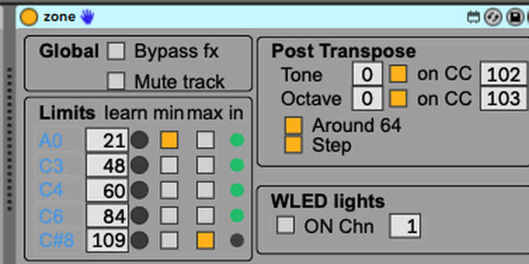

# Zone — keyboard split / zone filter for Ableton Live

**A Max for Live MIDI effect that plays only the keys you give it, then transposes the
result — with split points that are real, MIDI-mappable Live parameters.**

1. Download **[`zone.amxd`](https://github.com/Beennnn/zone-m4l/raw/main/zone.amxd)**
   (also listed on [maxforlive.com](https://www.maxforlive.com/library/device.php?id=15717)).
2. Drop it on a **MIDI track, before the instrument**, or into a rack chain.
3. Tick **Min** on the note that bounds the bottom and **Max** on the one that bounds the
   top. Stack one instance per instrument to build splits and layers.

Requires Live with Max for Live (Suite, or Standard + M4L). Built on Live 12 / Max 8.6.

## What it's for

Ableton's native key zones cannot be MIDI-mapped or automated, and anything that
transposes a split tends to drag the split point along with it. Zone filters on the keys
you actually play and shifts only the survivors **downstream**, so the boundary stays put
however far you transpose — and every boundary note is a Live parameter you can map to a
macro or a CC and move across several instruments at once, live.

## The controls at a glance

| | |
|---|---|
| **five notes, Min/Max per note** | tick which note bounds the bottom and which bounds the top; cross them for a notch. Type a note name or a MIDI number, or arm **Learn** and play it |
| **Oct / Tone** | transpose after the filter — ±4 octaves, −6…+5 semitones |
| **Tone / Oct via CC** | drive both from MIDI CCs (102 and 103 by default), with four value-mapping modes |
| **Bypass / Mute** | pass everything raw, or block all notes — no stuck notes either way |
| **Lights** | paint this zone's range as a coloured band on a WLED strip |

Everything that isn't a note passes through untouched — sustain, expression, pitch bend,
aftertouch, program change, and every CC except the ones assigned to Tone and Octave.

Every field, every default and every mode: **[docs/manual.md](docs/manual.md)**.

## Splits and layers

Put one Zone at the head of each instrument and MIDI-map the note bounds directly
(Cmd-M) — no rack, no internal linking. Map Zone A's **Max** and Zone B's **Min** to the
same control and one knob moves the split across both; because Max is exclusive, the two
zones meet with no overlap and never double a note.

A ready-made **[`rack/`](rack/)** preset does exactly this with four macros — Split
Point, Full Bass, Full Piano, Split — plus a demo Live set.

## Light your zones on a WLED strip

Turn **Lights** on and each Zone paints its keyboard range as a coloured band on an LED
strip, moving live as you move the split, via the open
[wled-midi](https://github.com/openlamp/wled-midi) convention. Setup and colour
assignment: **[docs/wled-lights.md](docs/wled-lights.md)**.

## Try it in the browser

**[Interactive demo](https://claude.ai/code/artifact/1a33057b-34ec-4ba8-b8df-364b2746d822)**
(or open [`zone-demo.html`](zone-demo.html) locally) — move a macro, watch one split point
drive several zones.

## Under the hood

The device, the `zone.js` brain it hot-reloads, the signal path and the hacking notes:
**[docs/internals.md](docs/internals.md)**.

Latest version, changelog and issues live here on GitHub — the maxforlive page is a
pointer to this repo.

## License

MIT — see [LICENSE](LICENSE).

---

**Splits for Live — and an optional bridge to light.** Zone is a standalone Max for Live
device; its optional WLED output speaks the open
[**wled-midi**](https://github.com/openlamp/wled-midi) convention — the agreed dictionary
between [**MIDI**](https://midi.org) (the MIDI Association) and
[**WLED**](https://kno.wled.ge). Part of the [OpenLamp](https://github.com/openlamp)
ecosystem; free for anyone to build on.
